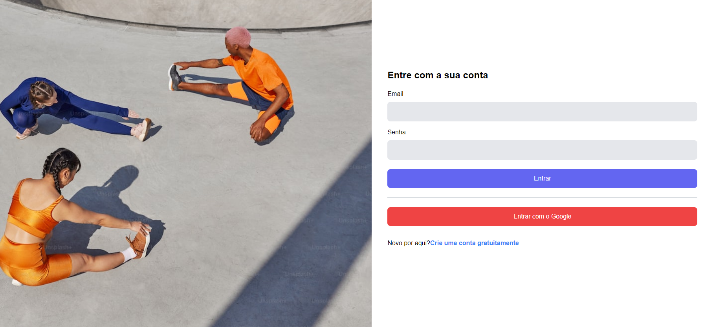

# Admin Template


<p align="center">
    
</p>


> Projeto realizado para colocar em prática os meus conhecimentos em Next.js, criando admin template.

## 📍 Deploy

Link do projeto: https://admin-template-flax.vercel.app/

## 💻 Pré-requisitos

Antes de começar, verifique se você atendeu aos seguintes requisitos:

- Você instalou a versão mais recente de `< Node >`

## 🚀 Instalando Admin Template

Para rodar o Admin é necessário instalar as dependências, siga então as seguintes etapas:

* crie um arquivo no diretório raiz do projeto chamada .env.local e coloque sa seguintes variáveis de ambiente de acordo com seu firebase: `NEXT_PUBLIC_FIREBASE_API_KEY`, `NEXT_PUBLIC_FIREBASE_AUTH_DOMAIN` e `NEXT_PUBLIC_FIREBASE_PROJECT_ID`. Com isso basta executar os comandos a seguir.

```
npm i
npm run dev
```

## ☕ Usando Quiz

* Login e cadastro via firebase



* Escolha de temas


